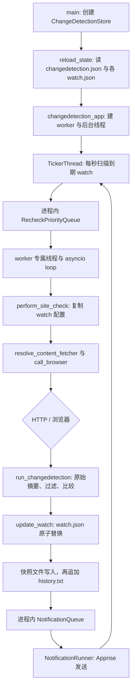

# changedetection.io 架构与单次检查调用链

调研日期：2026-09-29（Asia/Shanghai）  
版本：`v0.60.7`，commit [`593e9cc48c2b475dacbc3dbdebe2f5136bef8efa`](https://github.com/dgtlmoon/changedetection.io/commit/593e9cc48c2b475dacbc3dbdebe2f5136bef8efa)。本文所有上游代码链接固定在此 commit。  
证据标记：**源码确认**表示该路径直接见于源码；**推断**表示由调用顺序推得、未在运行时故障注入验证；**未知**表示本次没有证据。

## 单次检查的调用链

**源码确认。** 启动先构造 `ChangeDetectionStore` 并同步装载状态，再创建 fetch worker；非 batch 模式另外启动受监督的 ticker 和通知线程。[存储构造及加载](https://github.com/dgtlmoon/changedetection.io/blob/593e9cc48c2b475dacbc3dbdebe2f5136bef8efa/changedetectionio/store/__init__.py#L55-L67) · [CLI 创建 datastore](https://github.com/dgtlmoon/changedetection.io/blob/593e9cc48c2b475dacbc3dbdebe2f5136bef8efa/changedetectionio/__init__.py#L351-L357) · [后台线程启动](https://github.com/dgtlmoon/changedetection.io/blob/593e9cc48c2b475dacbc3dbdebe2f5136bef8efa/changedetectionio/flask_app.py#L1244-L1284)

worker 从队列取出 UUID 并原子认领，创建 processor、抓取页面，再把**当前 datastore 中的 live watch**交给 `run_changedetection()`；处理成功时先提交 watch 元数据，随后写历史快照和索引，最后才把通知放进通知队列。[worker 取队列及认领](https://github.com/dgtlmoon/changedetection.io/blob/593e9cc48c2b475dacbc3dbdebe2f5136bef8efa/changedetectionio/worker.py#L84-L101) · [worker 抓取和比较](https://github.com/dgtlmoon/changedetection.io/blob/593e9cc48c2b475dacbc3dbdebe2f5136bef8efa/changedetectionio/worker.py#L145-L199) · [状态、快照和通知顺序](https://github.com/dgtlmoon/changedetection.io/blob/593e9cc48c2b475dacbc3dbdebe2f5136bef8efa/changedetectionio/worker.py#L535-L603)

## 运行结构和组件

| 环节 | v0.60.7 的实际实现 | 共享状态与边界 |
| --- | --- | --- |
| HTTP 与解析 | 默认 `html_requests`，用 `requests.Session` 和 `urllib3.Retry`；内置文本/JSON processor 负责抽取、过滤和比较。BeautifulSoup4 等库供 HTML 处理使用。 | 同步 HTTP 请求通过 asyncio loop 的默认 executor 执行；处理代码由 worker 的 executor 执行。请求细节见 [HTTP fetcher](https://github.com/dgtlmoon/changedetection.io/blob/593e9cc48c2b475dacbc3dbdebe2f5136bef8efa/changedetectionio/content_fetchers/requests.py#L58-L79) 和 [processor](https://github.com/dgtlmoon/changedetection.io/blob/593e9cc48c2b475dacbc3dbdebe2f5136bef8efa/changedetectionio/processors/text_json_diff/processor.py#L419-L468)。 |
| 浏览器 | 可选 Playwright、Pyppeteer 或 Selenium fetcher；默认运行配置仍为 `html_requests`。 | 浏览器接口接收 URL、请求头/方法/body、代理、timeout；是否能连上浏览器服务另取决于配置和部署。见 [fetcher 选择](https://github.com/dgtlmoon/changedetection.io/blob/593e9cc48c2b475dacbc3dbde2f5136bef8efa/changedetectionio/content_fetchers/__init__.py#L107-L191)。 |
| 调度 | 一个受监督的 `TickerThread-ScheduleChecker`，普通模式每秒扫描；全局缺省间隔 3 小时，最小间隔缺省 3 秒。 | 进程内读取 `last_checked`、暂停/时间窗口和运行/排队 UUID；无持久化计划队列。见 [Ticker](https://github.com/dgtlmoon/changedetection.io/blob/593e9cc48c2b475dacbc3dbdebe2f5136bef8efa/changedetectionio/flask_app.py#L1383-L1398) · [到期判断](https://github.com/dgtlmoon/changedetection.io/blob/593e9cc48c2b475dacbc3dbdebe2f5136bef8efa/changedetectionio/flask_app.py#L1417-L1559)。 |
| 队列与并发 | `RecheckPriorityQueue` 用 `threading.Queue`、优先级 heap 和锁；每个 fetch worker 是独立线程和 asyncio event loop。另有 `ThreadPoolExecutor` 承担阻塞队列操作/处理。 | queue、运行 UUID map 和通知队列都只在进程内；watch 级运行 UUID 锁避免普通调度造成同一个 watch 重叠。见 [队列实现](https://github.com/dgtlmoon/changedetection.io/blob/593e9cc48c2b475dacbc3dbdebe2f5136bef8efa/changedetectionio/queue_handlers.py#L14-L50) · [worker pool](https://github.com/dgtlmoon/changedetection.io/blob/593e9cc48c2b475dacbc3dbdebe2f5136bef8efa/changedetectionio/worker_pool.py#L28-L37) · [每 worker 一线程/loop](https://github.com/dgtlmoon/changedetection.io/blob/593e9cc48c2b475dacbc3dbdebe2f5136bef8efa/changedetectionio/worker_pool.py#L39-L97)。 |
| 持久化 | 本版本实际 datastore 是 `ChangeDetectionStore`，继承 file-saving store；设置存为 `changedetection.json`，每个 watch 存在自己的 `watch.json`，历史另存快照文件和 `history.txt`。 | 当前源码树没有可选 Redis/SQL datastore 实现；抽象基类注释中的 Redis/SQL 是扩展示例，不代表可用后端。见 [文件 datastore 子类](https://github.com/dgtlmoon/changedetection.io/blob/593e9cc48c2b475dacbc3dbdebe2f5136bef8efa/changedetectionio/store/__init__.py#L38-L67) · [持久化实现](https://github.com/dgtlmoon/changedetection.io/blob/593e9cc48c2b475dacbc3dbdebe2f5136bef8efa/changedetectionio/store/file_saving_datastore.py#L35-L47)。 |
| 通知 | `NotificationQueue` 在内存中保存 job；`NotificationRunner` 调用 `process_notification()`，交给 Apprise。默认一个 runner，可用 `NOTIFICATION_WORKERS` 调整。 | 通知队列不落盘；投递失败时错误记录到 watch，但该 queue item 不由 runner 重新入队。见 [通知线程](https://github.com/dgtlmoon/changedetection.io/blob/593e9cc48c2b475dacbc3dbdebe2f5136bef8efa/changedetectionio/flask_app.py#L1266-L1272) · [runner](https://github.com/dgtlmoon/changedetection.io/blob/593e9cc48c2b475dacbc3dbdebe2f5136bef8efa/changedetectionio/flask_app.py#L1319-L1381)。 |

### 依赖是必需还是可选

- **必需路径：** Requests 是默认 HTTP fetcher；Apprise 是通知发送器；`pluggy` 提供扩展入口。`requirements.txt` 还列出 BeautifulSoup4 和 Selenium。[依赖声明](https://github.com/dgtlmoon/changedetection.io/blob/593e9cc48c2b475dacbc3dbdebe2f5136bef8efa/requirements.txt#L22-L23) · [Apprise / BeautifulSoup / Selenium](https://github.com/dgtlmoon/changedetection.io/blob/593e9cc48c2b475dacbc3dbdebe2f5136bef8efa/requirements.txt#L41-L42) · [browser 依赖说明](https://github.com/dgtlmoon/changedetection.io/blob/593e9cc48c2b475dacbc3dbdebe2f5136bef8efa/requirements.txt#L78-L92) · [pluggy](https://github.com/dgtlmoon/changedetection.io/blob/593e9cc48c2b475dacbc3dbdebe2f5136bef8efa/requirements.txt#L148-L148)。
- **浏览器可选路径：** `PLAYWRIGHT_DRIVER_URL` 配置后按 `FAST_PUPPETEER_CHROME_FETCHER` 选择 Playwright 或 Pyppeteer；未配置时导入 Selenium fetcher。Playwright 在 Docker build 阶段安装，源码说明并非所有平台都可安装。[browser backend 分支](https://github.com/dgtlmoon/changedetection.io/blob/593e9cc48c2b475dacbc3dbdebe2f5136bef8efa/changedetectionio/content_fetchers/__init__.py#L177-L191) · [Playwright 安装说明](https://github.com/dgtlmoon/changedetection.io/blob/593e9cc48c2b475dacbc3dbdebe2f5136bef8efa/requirements.txt#L89-L92)。
- **存储没有可选 backend：** 本次固定版本只查到文件 datastore；没有找到运行时 Redis 或 SQL backend。此结论限于该 commit 的源码树。

### 进程、线程、队列和共享状态

**源码确认。** 正常入口在一个应用实例中启动 Flask/Socket.IO 服务、worker 线程、一个 ticker 后台线程、通知后台线程和可选版本检查线程；Socket.IO 关闭后使用 Flask app server。外部浏览器服务可以另行部署，但不是 scheduler/queue worker。[主进程启动服务器](https://github.com/dgtlmoon/changedetection.io/blob/593e9cc48c2b475dacbc3dbdebe2f5136bef8efa/changedetectionio/__init__.py#L615-L644) · [背景线程](https://github.com/dgtlmoon/changedetection.io/blob/593e9cc48c2b475dacbc3dbdebe2f5136bef8efa/changedetectionio/flask_app.py#L1244-L1284)

worker 数量由 `FETCH_WORKERS` 覆盖，否则取 `settings.requests.workers`（缺省 5）；但 queue 操作 executor 的缺省线程数单独从 `FETCH_WORKERS` 读取（缺省 10）。因此缺省配置下，“fetch worker 数”和“executor 线程数”并不必然相等。[worker 数配置](https://github.com/dgtlmoon/changedetection.io/blob/593e9cc48c2b475dacbc3dbdebe2f5136bef8efa/changedetectionio/flask_app.py#L1244-L1248) · [executor 配置](https://github.com/dgtlmoon/changedetection.io/blob/593e9cc48c2b475dacbc3dbdebe2f5136bef8efa/changedetectionio/worker_pool.py#L28-L37)

**线程自恢复与队列恢复不是一回事。** ticker 用 `thread_supervisor` 包装，意外返回或异常会重启；快速反复失败采用指数 backoff，上限 60 秒，连续运行至少 60 秒后重置。worker coroutine 处理完 10 个任务或运行 3600 秒会主动重启，未预期异常后等 5 秒再启动；worker 线程本身若意外死亡，ticker 每 60 秒的 health check 可补建缺少的 worker。这些机制恢复的是运行线程，不会持久化或重放已出队任务。[ticker supervisor 接入](https://github.com/dgtlmoon/changedetection.io/blob/593e9cc48c2b475dacbc3dbdebe2f5136bef8efa/changedetectionio/flask_app.py#L1251-L1265) · [监督线程的 restart/backoff](https://github.com/dgtlmoon/changedetection.io/blob/593e9cc48c2b475dacbc3dbdebe2f5136bef8efa/changedetectionio/thread_supervisor.py#L30-L119) · [worker restart loop](https://github.com/dgtlmoon/changedetection.io/blob/593e9cc48c2b475dacbc3dbdebe2f5136bef8efa/changedetectionio/worker_pool.py#L134-L164) · [health check](https://github.com/dgtlmoon/changedetection.io/blob/593e9cc48c2b475dacbc3dbdebe2f5136bef8efa/changedetectionio/worker_pool.py#L568-L623) · [worker restart 上限](https://github.com/dgtlmoon/changedetection.io/blob/593e9cc48c2b475dacbc3dbdebe2f5136bef8efa/changedetectionio/worker.py#L68-L69) · [worker restart 条件](https://github.com/dgtlmoon/changedetection.io/blob/593e9cc48c2b475dacbc3dbdebe2f5136bef8efa/changedetectionio/worker.py#L758-L764))

实际 queue `async_get()` 把同步 `threading.Queue.get()` 放进 executor；queue 源码中的类注释称 worker 等待时不需 executor threads，与实现不一致。`flask_app.py` 的“janus-based”注释也和实际纯 `threading.Queue` 实现不符，应以函数代码为准。[实际 async_get](https://github.com/dgtlmoon/changedetection.io/blob/593e9cc48c2b475dacbc3dbdebe2f5136bef8efa/changedetectionio/queue_handlers.py#L170-L211) · [通知 queue 使用 threading.Queue](https://github.com/dgtlmoon/changedetection.io/blob/593e9cc48c2b475dacbc3dbdebe2f5136bef8efa/changedetectionio/queue_handlers.py#L423-L466)

`ChangeDetectionStore` 声明 datastore 只支持单应用实例；因此不要把多个 web worker/进程指向同一数据目录当成安全扩展方式。浏览器远端服务不属于这个限制之外的队列持久化方案。[单进程 datastore 假设](https://github.com/dgtlmoon/changedetection.io/blob/593e9cc48c2b475dacbc3dbdebe2f5136bef8efa/changedetectionio/store/file_saving_datastore.py#L35-L47)

## 配置如何到达一次请求

1. 全局默认 fetcher 是 `html_requests`，可通过 `DEFAULT_FETCH_BACKEND` 改写；watch 可指定 fetcher，`system` 回落到全局 application 设置，特殊 PDF/browser-step 分支可能覆盖后端。[默认配置](https://github.com/dgtlmoon/changedetection.io/blob/593e9cc48c2b475dacbc3dbdebe2f5136bef8efa/changedetectionio/model/App.py#L31-L47) · [后端解析](https://github.com/dgtlmoon/changedetection.io/blob/593e9cc48c2b475dacbc3dbdebe2f5136bef8efa/changedetectionio/content_fetchers/__init__.py#L107-L170)
2. `perform_site_check` 创建时 deepcopy watch；`call_browser()` 从这个副本取 URL、watch headers、body、method 与 backend。系统 User-Agent、全局 headers、timeout、全局空页设置和 proxy 解析通过 live datastore 在 `call_browser()` 时取得。[watch 副本与请求组装](https://github.com/dgtlmoon/changedetection.io/blob/593e9cc48c2b475dacbc3dbdebe2f5136bef8efa/changedetectionio/processors/base.py#L35-L46) · [headers、timeout、请求参数](https://github.com/dgtlmoon/changedetection.io/blob/593e9cc48c2b475dacbc3dbdebe2f5136bef8efa/changedetectionio/processors/base.py#L183-L280)
3. worker 比较时传入 live watch；过滤规则又会读取当前 tag/global 配置。因此配置在 fetch 期间变化时，一次任务没有被版本号绑定的整体快照。**源码确认：** fetcher 持有 watch 副本，比较入口拿 live watch。**推断：** 一次 fetch 的请求参数和比较规则可能来自不同时间点，无法保证配置原子一致。[副本构造](https://github.com/dgtlmoon/changedetection.io/blob/593e9cc48c2b475dacbc3dbdebe2f5136bef8efa/changedetectionio/processors/base.py#L35-L40) · [live watch 传给 processor](https://github.com/dgtlmoon/changedetection.io/blob/593e9cc48c2b475dacbc3dbde2f5136bef8efa/changedetectionio/worker.py#L180-L199)

## 对 SignalNest 的边界

**建议（不是上游事实）：** SignalNest 当前 1～3 个站点使用一个同步协调流程即可。可以借鉴“到期判断、抓取、纯解析/比较、短持久化事务”的职责边界；不要复制多线程 worker 池、插件 fetcher 或 browser 栈。涉及失败状态和持久队列的建议见 [SignalNest 决策映射](changedetection-io-signalnest-decisions.md)。
