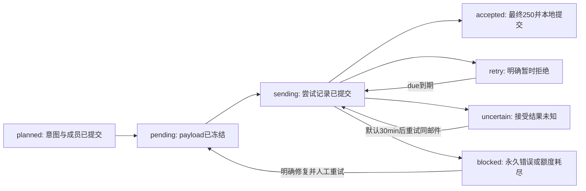

# SignalNest Email 可靠投递设计

日期：2026-10-05。范围：单用户、单收件人、SQLite、同步串行发送；定义立即通知、Digest、历史基线、更新事件与失败恢复。**建议方案，尚未实现**。已补[Profile与规则决策N0](notification-decisions.md)，并纠正原稿关于documents AUTOINCREMENT的错误；相关性/首启候选以该补充为准。本次实际读取当前源码和官方协议/标准库资料；未运行邮件实验、访问账号或发送邮件。当前工作区为HEAD `92ddaeeed8fceeda2ecf2931622d67f855ca878e` 加未提交的采集/运行政策改动。

## 1. 保证与默认选择

**建议默认：**标准库 `email` + `smtplib`，发送到用户显式配置的SMTP submission服务；不自建公网MTA，不引入邮件平台SDK/队列。SMTP服务、地址与凭据尚未选择；实现默认关闭发送。可靠性分三层：

1. **本地事件、决策与投递资格原子登记**：成功详情、通知比较基线、候选事件、N0决策与立即投递意图同SQLite事务提交；Digest/REVIEW登记选中决策，后续批次计划再创建outbox。IGNORE不建邮件意图。事务回滚一起回滚。
2. **每个逻辑事件只分配一条邮件路径**：数据库唯一键防重复生成任务/重复进入Digest。
3. **外部接受存在歧义**：SMTP接受与SQLite提交不能组成原子事务。不确定时默认优先减少漏报、重发同一冻结邮件，可能产生重复；不承诺收件箱exactly-once或必达。有限自动重试耗尽后保留任务并暴露故障，不静默删除。

**官方事实。** DATA正文终止后的最终250表示服务接管投递责任，不能标“收件箱已送达”。最终250前超时可能导致重复；Message-ID标识消息，协议没有通用的收件端去重保证。[RFC 5321 §4.2.5](https://www.rfc-editor.org/rfc/rfc5321.html#section-4.2.5)、[DATA结束超时](https://www.rfc-editor.org/rfc/rfc5321.html#section-4.5.3.2.6)、[RFC 1047 同步窗口](https://www.rfc-editor.org/rfc/rfc1047.html)、[RFC 5322 Message-ID](https://www.rfc-editor.org/rfc/rfc5322.html#section-3.6.4)。下文状态用`accepted`而非`delivered`；退信、垃圾箱、阅读与服务接受后的内部失败第一版不追踪。

## 2. 何时产生邮件

### 2.1 默认 hybrid：经过相关性决策再选邮件路径

“立即”指详情成功提交后进入可发送队列，下一次发送运行尝试；建议每5分钟drain或采集成功后显式调用。不在采集事务中发邮件。当前普通采集30min，实际发现还受分页、详情容量、源冷却影响，因此不能承诺网站发布后5min送达。

| 事实 | 邮件政策 |
| --- | --- |
| 启用后新身份首次live成功，来源regular | 产生new候选；N0按兴趣、资格、时间与优先级选IMMEDIATE/DIGEST/REVIEW/IGNORE，近期日期不单独触发立即通知。 |
| 启用身份集合中的近期机会 | 一次activation_recent候选，N0决策，默认最高DIGEST；REVIEW单列待核对。具体窗口、延期与媒体不足见N0。 |
| 较老bootstrap / historical / unknown首次详情成功，无首启候选依据 | 仅建立比较基线，默认无首次邮件；不从当前run origin推断新发布。 |
| 已有live基线，确认规范内容真实变化 | 产生update事件，重新N0决策；普通相关变化DIGEST、条件未知REVIEW、无关IGNORE；已关注机会的撤销/条件变化按N0例外提醒。 |
| 304/重复200、同内容、统计噪音、附件access变化、HTTP或Parser失败 | 无新/更新事件。失败由状态诊断展示，第一版不再通过邮件报告邮件发送故障。 |
| 离线import/reparse、维护规则重建 | 不生成Email事件，也不改变独立live通知基线。 |

另支持`digest_only`将IMMEDIATE降为DIGEST；REVIEW始终进待核对区，IGNORE不发送。原稿immediate_only/updates=immediate旁路删除，以Profile主题偏好表达立即优先级。立即事件不再在Digest重复列出；事件引用选中decision，已登记意图不因切换模式或Profile改版重建/重路由。

### 2.2 启用及历史导入边界

建议首次启用先完成一次full列表发现，**不要求历史详情全部完成**；显式`email-activate`持实例锁，短事务保存installation UUID、activation_at和已有`(source_id, source_document_id)`身份集合。**纠正：当前DDL没有SQLite AUTOINCREMENT；Column参数不是该保证。**原数字ID水位只有“不删除、不复用、不修改ID、自动分配新ID”的前提才可用，本方案改用身份集合，不为此重建documents。证据与最小成员记录见[N0 §4](notification-decisions.md#4-首次启用保留历史基线也检查近期机会)。

**当前代码事实。** discovery_origin/first_discovery_run_id首次保存后不改；首个完整扫描成功才结束bootstrap，之后regular也可能发现旧文；foreground只是前两页未成功处理者。[发现upsert](../src/signalnest/ingestion.py)，217–235行；[bootstrap提交](../src/signalnest/ingestion_state.py)；[前景分类](../src/signalnest/runtime_policy.py)。不能把foreground、当前run origin或详情成功日期当“新发布”。

启用时无需把每个已有版本生成邮件；既有通知第一次**启用后的live成功**建立基线。老历史首次静默；首启日期及之前6个上海自然日的候选经规则进入DIGEST/REVIEW/IGNORE，避免抑制仍相关的近期机会；启用预览可显式关闭近期回顾。延期候选用固定activation_at窗口，不能到第8天自动丢弃。首个比较窗口内的改动可能只成为基线，不能猜编辑时间。无法完成full时不自动降低启用要求。

“首次”以`notification_observations`是否存在判断，不以`documents.last_success_at`判断。启用后regular新身份即使先经离线import成功，也仍在第一次live成功时按身份集合/origin判断new候选，再经N0决策；离线产物既不抢占通知基线，也不触发首发。

`send_enabled=false`在已激活后只暂停发送，仍登记事件/决策，重新开启处理原任务；首次未激活时不创建observation、事件或投递意图。暂时停发不重置身份集合/事件序号。再次激活拒绝悄悄重设基线，显式重置是另一个维护操作。

## 3. 内容事件与发送唯一键

### 3.1 版本不是内容事件

**代码事实。**版本唯一键是`(document_id, content_sha256, parser_version)`；A→B→A复用旧A，规则升级同hash仍可产生新version_id。`reparse`还可把旧原文设为当前版本。[schema](../src/signalnest/schema.py)，119–135行；[save_notice_in_transaction](../src/signalnest/ingestion.py)，517–598行；[摘要](../src/signalnest/contracts.py)，127–146行。

因此不能用`document+version_id`或`document+hash`作为事件键，不能因current变化就发信。增加独立每条通知的live observation：baseline_version_id、baseline_body_response_id（实际比较原文）、observed_at、event_seq。离线操作不触碰它；原version.raw_response_id是首次形成产物的证据，不能代替最新live正文证据。

同Parser比较规范内容hash：相同不产生事件，不同产生update，即使N0决定IGNORE也保留该事件及理由。首次有依据的新发现/首启近期机会产生new/activation_recent候选；静默历史首次只保存baseline、seq=0。事件与选中decision分开，不把内容变化直接解释为要发送。事件序号在**同一成功事务**中递增，逻辑键为：

```text
event_key = installation_id / document_id / event_seq
immediate_delivery_key = installation_id / recipient_key / immediate / event_key
digest_delivery_key = installation_id / recipient_key / digest / slot_utc / part
Message-ID = <sha256(delivery_key)@显式配置的发件域名>
```

`recipient_key`第一版固定primary，不把地址当隐式新收件人；地址实际值冻结在邮件中。事件键不含run_id/时间戳/Parser版本。baseline A → B → A分别得到事件1、2，即使A复用旧version；重复处理同A没有事件3。

### 3.2 Parser升级

- Parser不同而原文hash相同：规则变化，静默重建live baseline，不发内容更新。
- Parser与原文都不同：在事务外用**当前Parser**重解析旧live baseline原文，与新产物按同一规则比较；相同不发，不同才是真实更新候选。通知附加解析不进入DB事务。
- 旧原文丢失/损坏或新Parser无法处理旧模板：记录`comparison_unknown`，第一版静默建立新基线并给status诊断；不能把差hash自动解释为更新，也不能声称确认“无变化”。可能漏掉与规则升级同时发生的一次真实更新，这是未知比较下的显式限制。

建议传显式`notification_context=live/offline/maintenance`，而非仅复用automatic=True；automatic当前只保证选最新匹配原文，不表示是否应通知。notification baseline独立，故offline把current从B改A后，下一次live仍B不会制造虚假的update。

## 4. Digest：先冻结批次，再发送

建议每日08:00 Asia/Shanghai一档，最多50事件/封、完整MIME bytes≤128KiB，正文纯文本，不发空Digest。到期由每5min发送入口检查，无需新的后台线程。

1. 选择选中Action为DIGEST/REVIEW（或digest_only降级IMMEDIATE）、`route=digest AND outbox_id IS NULL`的持久事件，事件occurred_at≤最近已到的08:00 slot；REVIEW单列待核对，冻结reason/未知项。不限“过去24小时”，长期停机后仍包含以前未分配事件。不按`last_digest_sent_at`划掉积压。
2. 持实例锁，按事件ID稳定排序，在事务外从不可变事件版本渲染候选邮件，按**最多50事件且最终MIME bytes≤128KiB**装箱。摘要/标题/链接有确定截断与官网回看提示；单项仍超限时记录渲染阻断，不丢掉事件。在**同一计划事务**再次核对未分配成员、创建已冻结payload的pending outbox并关联精确event ID集合。渲染失败时尚未分配；不能先固定成员再因超限换批次。每个事件仅有一个outbox_id；该外键就是第一版单收件人的membership，约束禁止immediate事件被加入Digest。
3. slot/part唯一；同锁下part从该slot已有MAX(part)+1分配。事件可用追加且不删除/改ID的整数主键作展示排序，同一通知按event_seq保留变化顺序；不凭Column autoincrement参数宣称SQLite永不复用。每次最多计划5封，多次计划继续未分配者，不重建/追加已有批次。迟到的新事件放下个slot（如果发生时间已经晚于最近slot）。错过多个slot时生成最近slot的“补发汇总”，不为每个空白日期造邮件。
4. 正文、收件地址、Message-ID、Date、渲染版本、精确事件集合冻结。立即邮件在详情成功事务先登记planned，随后渲染并原子保存bytes与sha后才pending；Digest按上条预先装箱后一次计划事务冻结。planned保存渲染版本、Date及事件引用；实现应保留该渲染规则，规则不可用时阻断而非悄悄替换。重试不能读取当前document或把后续事件追加进去。
5. 一篇文在slot内B→A→C第一版保留3个独立事件及变化顺序；不做会掩盖回退的自动合并。将来可只在展示层折叠，membership仍保留所有事件。

正常业务“立即邮件accepted但Digest又发一次”被本地membership挡住；SMTP不确定重试导致的两封相同邮件是另一种重复，不应混为同一去重问题。Digest失败时所有成员保持原批次，不能放回未分配池或换一个Digest key。

## 5. 必要持久状态与事务接入

建议以下5张邮件/事件表，加[N0](notification-decisions.md#5-决策证据版本与事务)的policy revision、decision和activation member记录；单收件人用events.outbox_id表示membership，不提前建订阅/多渠道平台。

| 表 | 最少关键字段 / 用途 |
| --- | --- |
| `email_channel_state`（单行/primary） | installation_id、source_id、activation_at、recipient_key、active_from/active_to、active_policy_revision、sending_paused_reason；启用事实、冻结地址与全局认证/配置阻断。已有身份用activation_members，不保存数字水位；凭据不存这里。 |
| `notification_observations`（document_id PK） | baseline_version_id、baseline_body_response_id、observed_at、event_seq、last_comparison_error_code/at；last live比较状态，不等于current_version或最后已发送版本。unknown诊断持久化，下次确认比较成功后清除。 |
| `notification_events` | 整数id/事件键、document_id+event_seq唯一、kind new/update/activation_recent、previous_version_id/version_id、body/observed response、occurred_at、selected_decision_id、route immediate/digest/none、outbox_id nullable；IGNORE为none；引用不可变版本与选中决策，不引用current作为展示事实。 |
| `email_outbox` | id、delivery_key唯一、kind、recipient_key、冻结from/to/subject、Message-ID唯一、digest slot/part、render_version、payload_bytes BLOB/sha、state、attempt_count、manual_retry_pending、next_attempt_at、accepted_at、有限last_error；网络前可恢复的完整投递意图。 |
| `email_attempts` | outbox_id+attempt_no唯一、started/finished_at、stage、result accepted/retryable/uncertain/permanent、有限SMTP回复码；无法完成的尝试可在重启核对。不得保存AUTH内容、任意服务器回复或整段异常。 |

payload、recipient与Message-ID在第一次发送前完整保存；events立即route必须关联对应outbox，digest route可暂未分配，none无outbox。outbox引用冻结的decision；planned不允许网络；accepted须有accepted_at和接受结果；uncertain不允许伪造accepted时间。数据库外键需验证version/body/observation属同一document、decision属同一event，普通FK本身不足以证明全部语义。

**接入点：**拓展现有`save_notice_in_transaction`，同短事务完成版本/current/成功/due、live比较、observation、event、N0决策与IMMEDIATE的planned outbox；DIGEST/REVIEW登记投递资格，IGNORE仅决策，历史静默仅baseline。附加Parser、原文读取、决策计算和邮件渲染均在事务外；立即任务渲染后第二个短事务冻结payload。不能等`process_response`返回再建事件；现函数经`save_notice`自行提交，需在该成功事务内调用通知记录函数。[现调用路径](../src/signalnest/ingestion.py)，715–733行。

事务外准备比较/决策时保留baseline版本/原文/seq及active policy token，提交事务重读并核对；不匹配则重新准备，不用过期比较或Profile覆盖较新状态。串行实例锁降低竞争，但不能替代这个接口约束。Digest在后续独立计划事务分配；立即planned随内容成功提交。

只有列表发现、详情失败或run整体失败不生成成功内容事件。详情事务已提交而run收尾失败，邮件事件仍可发送；不要求run=succeeded才消费。邮件失败也不把documents从processed改failed，不重抓网站来“补邮件”。

## 6. 发送状态机与崩溃窗口



发送进程持同一实例writer_lock，顺序消费；没有线程池/claim lease。网络全在SQLite事务之外，OS锁跨发送期间保持，因此很慢的发送会暂时挡住采集，第二实例跳过。第一版每次最多5封、每封只尝试一次，无transport内重试；默认每5min执行、run协作预算300s。预算不足保留下一封，不能留下先标sending但不知是否发过的未解释记录。

步骤：短事务将pending/retry/uncertain标sending、写attempt_no与started_at→网络→短事务保存result/state/due。进程拿锁后发现上次遗留sending/未结束attempt，一律标uncertain；不能当作肯定失败或肯定成功。即使实际崩溃在连接前，这样保守归类也可恢复同任务。

恢复事务结束旧attempt，不新增尝试次数；due从本次recovered_at起取普通退避与30min较大值，并一次持久化。已恢复的uncertain再次启动不重新延后；已耗尽许可则blocked且保留uncertain结果。发送按到期时间/任务ID稳定排序，未到期重试不挡住其他邮件。网络前状态/attempt提交失败绝不发，任意结果写入失败立即停止整个drain。

### 核心故障矩阵

| 边界/证据 | 恢复决定 |
| --- | --- |
| 内容成功事务提交前 | 版本/current/事件/意图一起回滚；下次详情处理重新登记，不存在“有成功内容无事件”。 |
| 内容事务已提交，尚未render/发送 | planned/pending持久；渲染/发送入口继续，不重新生成内容事件。 |
| sending提交后，连接/认证前进程终止 | 下次uncertain；保留同delivery key/payload，不新建任务。 |
| 连接失败，确认尚未发DATA | 明确retryable；持久due重试。 |
| DATA收到最终明确4xx/5xx | 分别retry/blocked；属于明确拒绝，不当作uncertain。 |
| 正文开始交给网络后断线/超时，未读到最终回复 | uncertain；客户端无法证明是否被接受。partial send也保守归此类。 |
| **服务已接受，客户端未拿到250** | uncertain；默认重发同邮件，可能两份，这是协议同步窗口。 |
| **客户端已读250，本地accepted提交前崩溃/数据库失败** | 本地仍sending，重启uncertain。禁止根据Message-ID猜测服务已经去重；默认仍重发。数据库故障本次立即停止，不能在同进程另发一封。 |
| 读到最终250后，QUIT/close失败（包括本地accepted提交前） | 适配器仍返回accepted；随后保存接受结果。连接清理不覆盖接受结果，若保存失败仍落入前一不确定窗口。 |
| accepted提交后重启 | 不再自动发送；事件membership与任务一直保留用于去重。 |

**关键限制：**SQLite事务/outbox解决本地登记丢失，无法消除两条加粗窗口。SMTP没有通用查询“这个Message-ID已被接受吗”的操作；不确定状态需要真实服务幂等扩展或用户接受重复风险，不能靠发送前标成功来解决（那会漏报）。

### SMTP接口必须返回有限结果

单收件人；正常sendmail返回必须是空拒绝字典。连接前、MAIL/RCPT、DATA-init、body/await-final、accepted分阶段，不能仅看异常名称断定安全重试。

实现若只调用标准`SMTP.data()`而未区分其内部354握手与正文写入，进入该调用前就保守标记`body_or_final`；调用内断线均归uncertain，不假定异常证明“尚未发送”。只有实际观察到明确354前拒绝/最终拒绝才可按回复码分类。不要为了精确阶段复制整套smtplib或仅凭异常类推测。

**源码确认。**Python读写socket错误可能转成SMTPServerDisconnected；`sendmail`最终非250抛SMTPDataError，`with SMTP`退出时QUIT也可抛错。[v3.12.14读取](https://github.com/python/cpython/blob/v3.12.14/Lib/smtplib.py#L380-L405)、[最终DATA与sendmail](https://github.com/python/cpython/blob/v3.12.14/Lib/smtplib.py#L556-L583)、[最终250判断](https://github.com/python/cpython/blob/v3.12.14/Lib/smtplib.py#L891-L899)、[退出清理](https://github.com/python/cpython/blob/v3.12.14/Lib/smtplib.py#L280-L288)。发送函数应在清理前捕获接受结果；已明确接受时不要因QUIT异常调用重试。

TLS明确使用SMTP_SSL或强制STARTTLS，显式`ssl.create_default_context()`、证书/hostname校验、不允许失败后明文降级。[Python SSL](https://docs.python.org/3.12/library/ssl.html#ssl.create_default_context)、[smtplib接口](https://docs.python.org/3.12/library/smtplib.html)。凭据从显式配置的环境变量读取，日志不回显；邮件账户授权与真实测试留到实施后用户明确安排。

起步socket timeout可配置120s，适用于小邮件submission服务；不是总墙钟期限。RFC对最终DATA确认建议等待10分钟，120s是有意较短的应用取舍，可能增加uncertain/重复，服务真实特性尚未知；上线前可提高至600s。[RFC超时依据](https://www.rfc-editor.org/rfc/rfc5321.html#section-4.5.3.2.6)。不能用run=300s声称会强制取消阻塞SMTP。过期时已进入DATA也必须归uncertain，不是安全取消。

## 7. 重试与配置变化

**默认建议：**

- 暂时连接/明确4xx：总最多6次尝试；失败后的延迟为5min、15min、1h、6h、24h，加只延后的0–30s jitter。一次drain不再次尝试同邮件。
- uncertain：至少30min后，再按相同attempt计数重发原bytes；同一Message-ID和delivery key。下一due取普通退避与30min的较晚值。等待不消除重复风险。
- 明确地址/内容5xx、TLS验证错误：blocked；认证错误暂停整个发送通道，防止其余任务重复撞同凭据。暂时认证4xx可延后，不将所有鉴权异常当永久错误。修复后显式恢复，不改原任务身份。
- 到第6次仍失败/不确定：blocked且原因retry_exhausted，保留数据、status非零/诊断；人工可重新安排原任务，不能删除重建来绕过去重。人工retry只授予一次额外尝试（持久`manual_retry_pending`，网络前消费），不重置累计attempt_no；仍失败/不确定则回blocked，保留实际结果，再次尝试需再次明确安排。
- 成功任务不自动清理唯一键。未来清理payload可保留delivery tombstone、membership与事件事实；第一版不做清理。

收件地址/from/内容/模板/route在冻结后不修改；SMTP凭据修复可沿用原任务，但更换服务对uncertain邮件属于跨服务重发，必须保持“可能重复”的记录。activate将active_from/to冻结到channel，包含尚未分配的Digest事件；后续配置地址不一致就阻断计划/发送，不能自动迁移积压。第一版不实现换地址维护，需另定已尝试任务与未分配事件的迁移规则。恢复过旧备份也可能丢失已接受记录而重发，恢复后先暂停发送并检查状态；不声称数据库备份能恢复外部接受事实。

邮件配置包含：send_enabled、hybrid/digest_only、单收件人/from、SMTP host/port/TLS方式、password_env、timeout、Digest时间/时区、消息/批次上限和有限重试；Profile/透明规则另由N0校验并保存revision。事件采集启用事实由activate持久化，不另设容易混淆的enabled开关。无需邮件模板DSL、HTML正文转发、附件下载或服务webhook平台。先发纯文本标题、站点日期、发现/更新时间、决策理由/未知项、稳定官网链接及有限摘要；不嵌入未清洗body_html、远程图片或验证码附件。Message-ID域名应显式来自发件人授权域，header拒绝CRLF；展示内容冻结到具体事件/decision版本。

## 8. 服务幂等能力：可选、暂不采用

**官方事实，未实际调用。**Resend支持POST /emails与/emails/batch的Idempotency-Key，同键同请求在24h内返回原结果；同键改正文为409，另有专用SMTP头Resend-Idempotency-Key。[官方幂等文档](https://resend.com/docs/dashboard/emails/idempotency-keys)。这不是一般SMTP的属性，文档未清楚承诺跨账户/端点/区域的键范围。

如果未来使用有真实幂等协议的服务，仍需相同冻结payload/key、持久首次尝试时间、24h窗口内重试；窗口过后uncertain不再声称安全去重。请求去重也不等于收件箱exactly-once。当前不选服务、不购买、不引入SDK；SMTP基础任务保持小。

## 9. 验收场景与任务入口

以下是**要求实现的测试，不是本次已执行实验**；全部先用fake SMTP adapter、临时SQLite/模拟服务，不发真实邮件。

| ID | 输入/故障 | 验收结果 |
| --- | --- | --- |
| E1 | 首次历史发现，几天后regular运行才成功详情 | 旧历史仅baseline；集合内近期机会可有一次activation_recent决策，延期不改变固定窗口；不生成双事件。 |
| E2 | 启用后regular近期新发现、重复200、304 | 一个new候选/N0决策；只有IMMEDIATE建立即任务；同内容后续无新事件，各Action按N0验收。 |
| E3 | A→B→A且复用旧A version | 两个update、两个不同event_seq；不因hash/version唯一键丢掉回退。 |
| E4 | Parser升级相同raw；raw不同需旧文重解析；旧原文不可用 | 依规则静默/同口径update/comparison_unknown，不误把规则改动发成网站更新。 |
| E5 | offline把current B改A，随后live仍B | observation未被offline污染，零update。 |
| E6 | event/decision/意图insert抛错，或内容事务后run收尾失败 | 前者整组回滚；后者已提交且Action选中的事件仍可投递。 |
| E7 | hybrid立即事件、Digest计划重复运行、超大摘要、超过5封积压 | immediate不再入Digest；每事件仅一个outbox；计数/完整MIME字节同时合规；有界重复计划继续MAX(part)+1，不丢超限事件。 |
| E8 | 停机三天、有旧未分配事件，Digest部分发送失败 | 补发所有持久未分配事件，最多50/封；失败成员留原批次，不能按最后发送时间丢掉。 |
| E9 | Digest冻结后又有新内容/换模板；尚未计划时换收件地址 | 重试payload bytes/hash/Message-ID/成员完全相同；新事件另待下slot；地址不匹配阻断，不让积压改投。 |
| E10 | mock服务已接受正文但不返回250 | uncertain；重启后同payload重试，mock可观察两次外部接受；测试不得声称去重成功。 |
| E11 | mock已返回250，accepted本地事务前SIGKILL | 数据库sending→uncertain；同delivery重试可能重复；事件不重建。 |
| E12 | accepted事务提交后SIGKILL；最终250后、DB提交前QUIT异常 | 前者重新启动0次重发；后者adapter仍返回accepted并正常记录，不能反转结果。 |
| E13 | 确认DATA 450/550、认证/TLS失败、socket异常 | 分类retry/blocked/通道暂停/阶段uncertain；有限错误、无密码/网页/服务器回复泄露。 |
| E14 | 6次失败、重启、人工retry | blocked保留；due跨运行正确且不每次启动顺延；人工一次许可、累计序号递增、原身份不变。 |
| E15 | 未启用/发送暂停、两进程争锁 | 未启用无事件，激活后暂停仍积压；第二sender/采集不重叠写；无隐式真实网络。 |
| E16 | 接受后本地记录不可写、旧备份恢复 | 本次停止发送，不另发；恢复状态保守不确定/暂停，不猜送达。 |

决策边界与D1–D12见[N0补充](notification-decisions.md)；代码任务依赖、范围与完成标准见[通知模块实现任务](email-implementation-plan.md)。实施中服务选择与真实账号验证是独立步骤；本次没有启动生产代码或真实投递。
