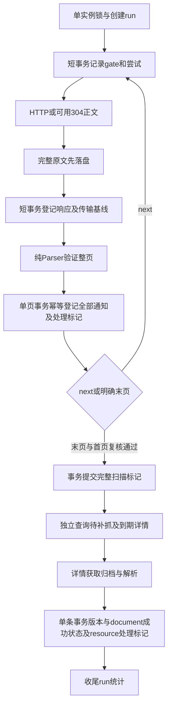

# SignalNest：单次可靠 HTTP 采集设计依据

调研与实验：2026-10-01；范围仅 WHU 本科生院“学生通知”、同步串行 HTTP、列表发现与详情处理。本文是**设计建议，尚未实现**。证据标签：**代码事实 / 页面观察 / 官方语义 / 离线实验 / 推断 / 建议 / 未知**。不修改应用、已有报告或 fixture，不建设调度平台或发送系统。

## 1. 起点与需要纠正的结论

**代码事实。** 已阅读 README、docs/design、parsing/fetching/contracts/schema，以及 WHU 报告、三份 changedetection 架构/可靠性/决策报告和 experiment-log。仓库及父目录未找到适用 AGENTS.md。开始时 Git 有未跟踪的 changedetection 报告和实验；研究期间另一位 Agent 增加 schema 的 `raw_responses.page_type/document_id`、迁移及 rawstore；这些改动未触碰。模型结论以开始时版本为基线，已把新增响应目标字段作为可复用接口，实施前需与完成后的离线入库代码核对。

- `parse_list` 缺少 `.page .p_pages` 时返回 None；分页容器存在但没有 next 标记、没有“下页”锚时也返回 None。**离线实验复现**删除首页 paginator 后仍得 25 条 / None；这不证明末页。
- 当前 `ListPage` 只有 entries / next_page_url；需增加显式分页证据。当前 Parser 不进行网络、缓存或状态短路，这是合适边界。
- `make_client` 已启用 TLS、`trust_env=False`、关闭自动跳转、单连接；connect/read 分别映射 pool/write。它没有重试、总耗时 deadline、响应体上限或请求间隔执行器。
- `documents.last_success_at` 表示详情业务成功，不能扩展成 HTTP、列表或完整扫描成功；`raw_responses` 的存在也不表示已解析/登记。
- 原 WHU 报告“首页 304 不解析、不取详情”“遇到完全已知页加一页结束”只能作为有漏报风险的优化；本设计不把它们当覆盖保证。
- changedetection 决策报告中的 claim/lease 对当前串行单实例过早；先用 OS 单实例锁。之前“有上限的 Retry-After”须改为**有上限的本次等待，保留完整延期时间**，不能截短后提前请求。
- 原文证据登记可以独立于业务成功；每页与每条详情分事务，不将整次扫描装进一个大事务。outbox 留待邮件阶段。

## 2. 真实分页：观察与 Parser 修正

### 2.1 有限样本

本次仅两次成功 GET：首页与原首页“尾页”明确指向的 `/tzgg/xstz/1.htm`，间隔 4 秒；无详情/附件请求。沙箱 DNS 首次失败，获准的网络执行成功；不用浏览器。时间为客户端实际 UTC 采集时间，响应 Date 单独保留，二者相差约 1 秒。

| 位置 | 来源与证据 | 可验证标记 |
| --- | --- | --- |
| 首页 | [新原文](fixtures/ingestion/student-notices-home-20261001.html)、[元数据](fixtures/ingestion/student-notices-home-20261001.json)；2026-10-01 08:06:28 UTC；200 / 22,191 bytes | 唯一 `.p_no_d`=1；first/prev 禁用；活动 next 指 `xstz/23.htm`，锚文本“下页”；活动 last 指 `xstz/1.htm`；最大可见页码24；25条。 |
| 中间页 | [既有第2页](fixtures/student-notices-page2.html)，2026-09-28样本，未重取 | `.p_no_d`=2；first/prev活动指首页；next `22.htm`；last `1.htm`；可见最大页码24；25条。不同日期样本只证明模板形态。 |
| 末页 | [新原文](fixtures/ingestion/student-notices-last-20261001.html)、[元数据](fixtures/ingestion/student-notices-last-20261001.json)；2026-10-01 08:06:32 UTC；200 / 19,799 bytes | 唯一 `.p_no_d`=24；first/prev活动；`.p_next_d`“下页”和`.p_last_d`“尾页”均无锚；最大页码24；13条。 |

首页 SHA-256 `bc85f99eb81ff44d3cc7eadaeba90f30412bfe7dab324d54e2ee4233379be87f`；末页 `4cbe1d6cd7f0309426ea57df7a6273283dbd1b051eb1315fd37fdb10647dee65`。无重定向。均有 ETag、Last-Modified、`private,max-age=600`、`Vary: User-Agent,Accept-Encoding`。只保存白名单头，Cookie 不保存。详细请求参数见 JSON。

**未知。** 未遍历24页，未实测总记录数；`23×25+13=588` 仅在所有中间页恰好25条、无重复时成立。未找到并验证可信的单页“学生通知”实例，不扩大栏目来制造证据；单页模板的终止表达仍未知。真实网站插文/撤文导致的分页变化未实验。

### 2.2 建议的纯 Parser 契约

`ListPage(entries, pagination)`；pagination 至少包含：

| 字段 | 建议语义 |
| --- | --- |
| `current_page: int` | 唯一 `.p_no_d` 的正整数；不是路由文件名。 |
| `total_pages: int` | 当前模板中最大可见数字；只有 last 状态、数字锚和当前标记相互一致时才接受其为总页数。未经确认的新模板不能凭最大数字猜。 |
| `next_page_url: WebUrl | None` | 活动 `.p_next a` 唯一且文本“下页”；相对于最终响应 URL 解析。 |
| `terminal: bool` / `terminal_evidence` | 末页必须有唯一无锚 `.p_next_d` 和 `.p_last_d`，可见文本匹配，且 current=total。返回固定证据类型 `disabled_next_and_last`，不要只暴露 None。 |

具体修正建议：

1. paginator 不存在/重复、数字标记缺失/重复/非整数、活动与禁用状态冲突、无 next 标记、当前页大于总页，都抛结构/字段错误。保留整页失败语义，不返回部分登记结果。
2. 非末页 current<total，必须有活动 next 和 last；next 指向可见 current+1 的数字锚（如在窗口内，须一致），last 指向 total 数字锚。末页 current=total必须满足禁用证据。不能按“少于25条”或“全是旧通知”认定末页。
3. URL仅 HTTPS、`uc.whu.edu.cn`、默认443、无凭据/fragment/query，精确匹配 `/tzgg/xstz.htm` 或 `/tzgg/xstz/[正整数].htm`。HTTP降级不接受。next不得指当前最终URL；不要自行计算反向文件编号。
4. 跨页协调器验证下一页 `current=previous+1`、总页数不变、首尾声明/目标一致；维护已访问请求URI及最终URI集合，任一循环即中断。重定向环与分页环分别分类。
5. 单页将来只有得到真实模板证据后新增明确证据类型：例如1/1且 next/last禁用。当前缺失paginator即失败。人工批准的新模板规则需新Parser版本；不根据行数/无链接自动放宽。

**推断。** 最大可见页码代表尾页的规则适用于三份现有样本，不是通用分页标准。模板改变应该暴露为失败并保存原文，不能自动修补成“无新通知”。

## 3. 扫描覆盖与详情批处理

### 3.1 覆盖状态与运行状态分开

`scan_status = running | complete | limited | interrupted`；`run_status = running | succeeded | partial_failure | failed | interrupted`。

- **complete**：本次从首页沿已验证next链到明确末页，每页解析且全部条目事务登记成功；页码连续1..total，总页数/声明一致；完成下面的首页复核。它表示完成当前链的尽力覆盖，不是源站同一时刻的一致快照。
- **limited**：预算主动停止，尚未到末页；原因 `page_limit/request_limit/time_limit`。即使页页全已知仍只能limited。到末页并满足所有条件时可complete。
- **interrupted**：网络/解析/DB失败、分页环、错误链接、页码漂移、复核首页变化；标记失败页与原因，保留已提交页。绝不推进完整扫描成功时间。
- 详情批次尚有待办但无本次错误：run可以succeeded，统计 `pending_remaining`；不能宣称所有详情已完成。某详情失败则run partial_failure，即使scan complete；完整列表成功标记仍可更新。首页失败而已有详情处理成功也为partial_failure；全无业务进展且失败为failed。

### 3.2 当前简单策略（建议参数，不是站点规则）

- 正常检查：先处理首页；最多2个列表页，覆盖记limited，随后最多20条详情。绝不因遇到已知ID而停止；跨页按稳定ID去重但保留全部行计数。
- 首次建立档案、停机超过24小时、上次full scan超过24小时或上次完整扫描失败待恢复：从首页启动full scan。页上限64、全运行物理请求上限120、运行协作时间预算10分钟；达到预算即limited且仍保留full scan due，不冒充成功。现状24页约需至少25次列表请求（含复核），无须下载全部历史详情。
- 完整扫描使用每页各自的验证器；收到304必须读取该页原文并取得分页和条目证据。首页304不证明第2页或尾页未变化，不能结束full scan。
- 到末页后再次验证首页（同请求profile，可带 `Cache-Control: no-cache` 请求重新验证；这不是绕过服务器权限）。复核结构、分页声明和**有序条目ID/URL/标题/日期**指纹；不把统计脚本噪音的raw hash变化直接当漂移。变化则scan interrupted `pagination_drift`，下次从首页重扫，本次不无限重启。
- 首次完整历史**列表发现**与详情下载分开；发现完成设置bootstrap发现标记，详情逐次20条，所有discovered/failed到期记录仍可补。普通新发现/到期复查优先，历史待办采用稳定顺序，保留少量配额防止饿死（例如20条中至少5条最早历史待办，若不足则借给其他项）。
- 到期详情必须有明确来源：首次成功后，发布时间在最近14天的条目建议24小时复查，其余30天复查；失败用HTTP分类或本地处理失败的due。日期只是复查频率策略，不用于扫描停止或判断撤回。这些值需配置，可被服务器冷却推迟；30天策略会延迟发现旧文修订，不能宣传实时更新覆盖。

**无法提供的保证。** 页面有各自缓存，扫描期间插文/删除可移动边界；首页复核只能降低风险，不能检测首页不变的内部页移动，或一篇通知在两次采集间出现后删除。页码不变也不证明边界稳定。幂等登记、相邻页自然重叠去重、每日完整回扫及停机后重扫降低遗漏，无法承诺零漏报。没有一致性快照API时，不根据一次缺席删除已有通知或推断撤回。

**不持久化页码游标。** 页码路由受插文影响；本阶段失败后从首页重新扫描，已经登记的通知幂等保留。24页规模可接受；如未来规模超过64页，再基于真实成本研究续扫方案。仅持久化run最后访问URI供诊断，不把它作为重启入口。

## 4. 条件请求：正文、验证器、处理状态

### 4.1 官方语义与本项目策略

**官方语义。** `If-None-Match` 优先于 `If-Modified-Since`；304无新正文。缓存验证需对应URI及Vary表示。Retry-After可为秒数或HTTP日期。[RFC 9110 条件优先级](https://www.rfc-editor.org/rfc/rfc9110.html#section-13.2.2)、[304](https://www.rfc-editor.org/rfc/rfc9110.html#section-15.4.5)、[Retry-After](https://www.rfc-editor.org/rfc/rfc9110.html#section-10.2.3)、[RFC 9111 Vary与验证](https://www.rfc-editor.org/rfc/rfc9111.html#section-4.1)。以下是应用策略，非完整缓存实现。

1. 有完整、摘要校验正确且URI/profile匹配的200归档，优先发送原样ETag（包括弱标签/引号，不解析其中的gzip后缀）；可同时发送原始有效Last-Modified，服务器应优先ETag。仅有日期时发If-Modified-Since；两者都无则普通GET，成功后比较规范内容。日期绝不使用本地抓取时间或通知发布日期替代。
2. **最新传输基线**是最新完整200归档，不是最新响应（可能304/错误），也不是只选已业务成功的旧200。即使最新200解析失败，下一次304仍必须重处理它；失败不会推进成功处理指针。不得拿以前成功A的验证器对应新正文B。
3. 每次发出条件请求时，在内存固定候选 `baseline_raw_response_id`；响应304只可指向这个候选，而不是收到响应后查“最新一条”。登记304证据并用关联字段链接200。数据库中304仍无body_path/body_sha256；正文由关联200取。
4. 缓存键至少 source_id + **实际GET的完整URI** + 请求profile。完整URI保留旧详情有意义的查询，不按文章ID共用ETag，不随意排序/删除查询；规范化scheme/host/default port且拒绝fragment。profile固定User-Agent、Accept、Accept-Encoding与其他表示选择头。`Vary`记录在基线上；profile变动、未知Vary字段或`Vary:*`时禁用条件复用，完整GET。若未来Cookies参与表示，必须另行设计；本阶段不继承/发送服务器Cookie，每个物理请求前清空client cookie jar，不带账号或授权头。
5. 200验证器与其正文一次登记，不以304把归档元数据覆写。304缺少ETag/Last-Modified沿用候选值；若发送了If-None-Match且304提供ETag，须与发出的唯一标签弱比较相同，异常标签/身份不一致触发一次无条件回退。仅发送If-Modified-Since时，可接纳该已绑定候选的304新提供的有效ETag。新的验证头作为后续请求元数据保存；Vary变化保守完整GET；不据304改写原200 Content-Type/encoding/body hash。[更新已存响应的语义](https://www.rfc-editor.org/rfc/rfc9111.html#section-4.3.4)
6. 重定向每跳重新查**目标URI自己的**基线，重新组装条件头；原地址即使以前跳到目标，也不能向原地址发目标的ETag。无目标基线则无条件GET。最终URI绑定原文；保存initial requested URL用于证据，不拿它替代实际验证URI。重定向规则详见下一节。

若未来响应明确`Cache-Control: no-store`，不登记可复用HTTP验证基线；历史证据归档与HTTP缓存用途分开。`no-cache`要求重新验证，不能当作不存在验证器；本源的`private`不妨碍单用户私有缓存。当前样本没有no-store，策略未用真实服务器验证。[缓存指令](https://www.rfc-editor.org/rfc/rfc9111.html#section-5.2.2)

### 4.2 响应序列与恢复规则

| 场景 | 必须发生的动作 / 可以推进的标记 |
| --- | --- |
| 第一次无条件GET竟收到304 | 登记异常响应；一次无条件回退，占共同重试额度。再304则`unexpected_304`失败，无成功处理/扫描标记。不能制造空HTML。 |
| 请求前基线文件丢失/摘要错误 | 禁用其条件资格，保留证据记录；直接完整GET，不主动发送无用验证器。 |
| 发出条件GET后文件才丢失/损坏 | 收到304时再次校验；一次无条件回退，仍遵守间隔与预算。失败不能改用无关旧正文。 |
| 200归档成功、Parser失败 | transport成功，业务失败；保留原文/验证器。相同Parser的下一次304仍重解析，不能raw hash短路清错误；无需立即重请求同错页。 |
| 200解析成功、DB提交回滚 | 下一次304再次解析并幂等事务登记；失败后业务标记仍旧。 |
| Parser版本升级，服务器未变 | 原文完整时可直接离线重解析；若本次采集304仍重处理原文。成功键 `(raw_id, parser_version)`；成功版本唯一键沿用现有设计。旧成功结果不替代新规则结果。 |
| 同raw+同Parser已成功 | 详情可复用已验证解析结果，但本次成功状态/复查due仍需事务更新；列表full scan仍须取得条目及next证据并登记/核对，第一版直接再parse，避免新增解析缓存。 |
| 首页304且有详情待办/到期 | 列表分支结束/继续按scan模式；详情查询始终独立执行，遵守source cooldown及运行预算。 |
| 首页304且完整回扫到期 | 从缓存首页解析next，然后逐页请求/验证直到末页，不能只更新last_complete_scan_at。 |
| 来源忽略条件头而总200 | 正常归档/比较，无害退化；只支持日期则用日期；无验证器则低频完整GET。不推断旧式详情未来始终无验证器。 |
| 403/429/5xx、200空白/错误模板 | 原文可作为失败证据，不能进入成功业务基线；非200不成为200传输基线。空200可归档，但无条件复用资格；非空错误模板的200仍允许重新验证/重解析，不覆盖成功通知版本。 |

**离线实验。** 临时文件+SQLite演示“归档提交→业务回滚→重开DB→304→重处理”以及同原文v2处理；HTTPX MockTransport验证无原文/丢失/损坏的304回退、自动跳转转发验证器、手动重建头。详见[实验记录](experiments/ingestion/experiment-log.md)。这不是已完成协调器的集成测试。

## 5. 有界同步 HTTP：建议默认策略

### 5.1 时间、次数与字节预算

**官方语义。** connect是建连接等待；read/write分别限制一次数据块接收/发送等待；pool是取连接等待，四者不构成总墙钟超时。[HTTPX timeouts](https://www.python-httpx.org/advanced/timeouts/)。一个Client可复用连接并需关闭。[Client生命周期](https://www.python-httpx.org/advanced/clients/)。

| 预算 | 第一版建议值与作用 |
| --- | --- |
| timeout | connect5s/read10s/write10s/pool2s；单连接Client在整次run内复用、context manager关闭。每跳开始按剩余逻辑预算收紧各timeout。 |
| 单资源逻辑获取预算 | monotonic60s，含间隔、跳转、重试等待及读取；每跳前、每块后检查。预算不足就停止/延期，不开新请求。 |
| 重试 | 一次逻辑获取共最多2个额外尝试额度；异常/status/304修复共用。原请求+最多3跳redirect+2额外尝试＝最多6个物理请求；redirect计数跨重试累计，不重启整条链。 |
| 本次等待 | 自动退避1s、2s加uniform[0,0.5]s jitter；每次还需满足3s间隔。服务器等待≤15s且预算足够才本次等；更长则持久延期。 |
| body | HTML最多2MiB完整实体字节；GET流式读，禁用 `.get().content` 全量预读。 |
| 全run | 64列表页、120物理请求、20详情、10min协作预算；参数写入run配置摘要。网络上限与页/详情上限分开。 |

**硬期限限制。** monotonic是协作deadline；同步HTTPX不能在阻塞DNS/连接/一次read内部由循环立即取消，也不能用read10s声称slow-drip响应最多10s。读取前的剩余timeout在后续多个read上不自动递减，故须每块检查，不能承诺精确60s硬终止。现实socket/DNS各平台行为本次未验证。若将来需要强制墙钟终止，再研究进程隔离；当前不引入线程池或异步栈。run10min同样为协作预算。

### 5.2 流式正文

- 请求固定 `Accept-Encoding: identity`，返回Content-Encoding不存在/identity时按原始实体流读取，增量hash/计数至临时文件；Content-Length超过上限可提前拒绝，但头缺失或说谎仍必须实际计数。长度短读、stream异常、预算耗尽都丢弃临时文件，不登记完整200正文。
- 为避免gzip炸弹使`iter_bytes`解码阶段先大量分配，第一版遇到非identity内容编码明确失败 `unsupported_content_encoding`，保存有限头信息；不要以流分块输出误认内存已被限制。已有新fixture实际无Content-Encoding，尽管ETag有gzip字样。未来需要压缩时再实现独立有界增量解压并同时限制编码/解码字节。
- 仅200且完整非空正文进入候选基线；Content-Type要求text/html（可带charset）；200空白/坏UTF8/模板失败分开分类。4xx/5xx可保存≤64KiB诊断正文，必须标明截断且不伪装成完整body的hash引用；当前契约不支持截断就只登记头/状态，勿存半份HTML。
- 304只登记头与验证引用，不读取为页面。redirect在校验Location后关闭响应，不解析其HTML。用 `with client.stream(...)` 或finally close保证失败路径释放连接；stream未读完可能失去该连接复用机会，但不能牺牲大小边界。

**源码事实 / 实验。** HTTPX0.28.1 `iter_bytes`自动解码后产出块；MockTransport直接调用handler，没有socket超时执行。[解码路径](https://github.com/encode/httpx/blob/0.28.1/httpx/_models.py#L884-L905)、[MockTransport](https://github.com/encode/httpx/blob/0.28.1/httpx/_transports/mock.py#L19-L27)。实验已验证超限/ReadError时stream关闭，未验证压缩炸弹或真实内存峰值。

### 5.3 失败分类与唯一重试层

**建议。** 仅采集HTTP边界拥有请求内重试；HTTPTransport保持`retries=0`，Parser/业务服务不再套重试。HTTPX内置transport重试只覆盖ConnectError/ConnectTimeout，非完整应用策略。[官方transport重试](https://www.python-httpx.org/advanced/transports/#http-transport)、[异常类型](https://www.python-httpx.org/exceptions/)。

| 分类 | 请求内动作 | 耗尽/终止后的动作 |
| --- | --- | --- |
| ConnectTimeout、临时ConnectError、ReadTimeout、ReadError、WriteTimeout/WriteError | GET可重试，丢弃部分正文；共用2额度 | 记resource失败、next_due至少15min；下次运行按due恢复。DNS无法精确判断暂时/永久时最多同样额度。 |
| TLS证书/hostname校验错误 | 不重试，不关闭verify | `tls_error`，至少30min/人工修复后再试；不自动改代理或CA。检查cause链类型，无法可靠分类的ConnectError最多有界重试，不凭异常字符串关闭安全。 |
| PoolTimeout、LocalProtocolError、非法URL | 串行阶段应为资源泄漏/编程或配置问题，不网络重试 | 显式失败，修正后再运行。RemoteProtocolError最多同传输额度；DecodingError不重试同表示。 |
| 403、401、404/410、其他4xx | 不请求内重试；403不自动换浏览器 | 保留已有版本，source阻断或条目失败；404不是直接删除通知证据。正常due至少30min，避免同轮反复。 |
| 429 | 推荐直接延期同主机，退出本次网络分支；不在本轮用掉剩余额度追打 | 持久source `not_before_at`，已有离线工作可继续；不能换URL避开等待。 |
| 500/502/503/504 | 共用额度；有Retry-After需先遵守 | 延期至少15min及服务端not-before；501/505等不自动重试。 |
| 200空正文/非HTML/错模板/ParseError | transport和parse分别记；同run不重请求指望改版恢复 | 业务失败、保存完整证据；未来due重新验证/处理，保留成功版本。 |
| 文件归档/SQLite提交失败 | 不重HTTP；同raw可恢复处理 | 本次partial failure，无法写状态则输出明确storage错误，旧成功指针不动。 |

403/200错误页不按文字黑名单处理；本站必需结构与身份校验是Parser的主要防线。HTML模仿正确结构的错误页仍可能逃过验证，未知且需真实证据再补规则。

### 5.4 Retry-After、间隔与重定向

**官方语义。** 秒数从响应接收起算，HTTP-date为UTC日期；429可以携带Retry-After。[RFC 9110](https://www.rfc-editor.org/rfc/rfc9110.html#section-10.2.3)、[RFC 6585 §4](https://www.rfc-editor.org/rfc/rfc6585.html#section-4)。

- 秒数仅非负ASCII十进制整数；日期用支持HTTP-date的解析器，过往日期等待0。记录接收UTC与原字段（有长度限制），不要把负数、小数、重复/无效值当0；无效/缺失429默认30min延期。
- `not_before = received_at + seconds` 或绝对HTTP日期；有效值不截短。如果15s等待上限/逻辑预算不够，持久化完整not-before并结束该任务；人工触发同样遵守。极端日期超SQLite整数/解析范围时暂停source并记录不可表示等待，不能溢出为立即到期。日期依赖本地UTC钟；保留Date供诊断，时钟准确性本次未验证。
- 同主机统一request gate：每个**物理请求启动**至少相隔3s，覆盖初次、重试、304修复、redirect及详情。gate同时读取持久 `not_before_at` 和 `last_request_started_at`；每次发出前短事务登记UTC启动时间，运行内用monotonic间隔。重启不消除冷却；未来异常时钟大幅漂移应显式报告，不能靠页游标恢复。
- `max(本地gate,退避deadline,Retry-After)`决定最早发送时间；服务器等待不能被jitter减短。收到带Retry-After的503也阻断该主机其他网络任务；3xx的Retry-After若存在，跟随前同样遵守。
- 手动允许301/302/303/307/308 GET跳转，最多3跳。Location必须唯一、可解析；只允许 `https://uc.whu.edu.cn:443`，列表目标保持栏目路径，详情目标必须同稳定ID的已支持新/旧路由。跨域、HTTPS降级、凭据、任意端口、登录/附件地址均拒绝。未知合法迁移待人工更新源规则；不扩大域名allowlist。
- 每跳重新组装headers，查目标自己的缓存；不透传原ETag/Last-Modified/Auth/Cookie，不调用`response.next_request`直接发送。**实验**HTTPX自动同域redirect会保留If-None-Match；[0.28.1复制请求头源码](https://github.com/encode/httpx/blob/0.28.1/httpx/_client.py#L546-L572)。当前`follow_redirects=False`应保留。
- TLS verify=True不变；`trust_env=False`使环境代理及SSL_CERT_FILE/DIR等环境配置不参与客户端配置，不等于禁用所有显式代理能力。第一版无显式proxy/自定义CA。[HTTPX环境变量](https://www.python-httpx.org/environment_variables/)、[SSL](https://www.python-httpx.org/advanced/ssl/)。不保存/回显Cookie、任意异常全文。

## 6. 最小持久状态与事务

以下表名/字段为**建议增量**，不要求照搬SQL。静态来源配置仍在TOML，新增source状态表用于运行事实。开始run固定一份配置与Parser版本；运行中修改配置下次生效，避免上游混合配置行为。

### 6.1 必要字段

| 位置 | 必要状态 | 解决的问题 / 更新时机 |
| --- | --- | --- |
| `source_ingestion_state`（source_id PK） | `last_list_attempt_at`、`last_list_transport_ok_at`、`last_list_registered_at` | 分别是首页尝试开始、200完整归档/可绑定304、首页全条目登记；不能兼任完整回扫。其他页时间在resource级。 |
| 同表 | `last_complete_scan_at`、`last_complete_scan_run_id`、`next_full_scan_due_at`、`bootstrap_scan_completed_at` | 仅满足完整扫描证据后最终事务更新；中断/limited不更新success/due。bootstrap指历史列表发现完成，不等于详情全部成功。 |
| 同表 | `last_request_started_at`、`not_before_at`、`next_list_due_at`、`last_list_error_code` | 同主机gate、服务端冷却、首页失败恢复与状态展示；完整回扫due与普通首页due独立。 |
| `resource_state`（source_id,resource_uri,request_profile_sha256 唯一） | `page_type/document_id`（可利用已有目标字段）、`baseline_raw_id`、`validator_response_id`、`etag/last_modified`、`vary`、profile JSON白名单 | baseline只指完整200；validator_response可指有效304，正文始终baseline200；URI/profile防验证器串用。原文校验失败禁用候选，证据不删除。 |
| 同表 | `last_attempt_at`、`last_transport_ok_at`、`last_processed_raw_id`、`last_processed_parser_version`、`last_processed_at`、`last_error_code`、`next_due_at` | 最新传输与成功处理分开；解析/提交失败留baseline新值但不推进processed值；重启知道最新raw仍待处理。最后processed指最近成功处理，raw失败不能清它。 |
| `raw_responses` 增量 | `resource_uri`、`request_profile_sha256`、`validated_raw_response_id` nullable FK、`vary`/必要cache头 | 304显式指本次选中的200，不添正文路径；checked FK目标200/URI/profile同一性由服务验证，普通FK不足以表达。已有page_type/document_id保留。 |
| `ingestion_runs`（run_id PK） | source、started/finished、mode normal/full/bootstrap、配置/Parser版本、run_status、scan_status、stop_reason、page/raw/new/detail成功失败计数、last_page_uri | 覆盖与结果可审计；启动时把上次running标成interrupted，不能当成功；游标只诊断。列表complete与run partial_failure可以同时成立。 |
| `documents` 增量 | `first_discovery_run_id`、`discovery_origin = bootstrap / regular`（首次值不可变） | bootstrap期间跨次发现统一标baseline；未来邮件可区分，不能根据详情下载日期把历史当新文。首次discovered_at已有，继续保留。 |

`resource_state`的处理标记是最新成功处理组合，不需要通用任务表或每个HTTP尝试一行状态机。若详情服务已有可恢复processing字段，应复用并避免双真相：document是业务成功指针，resource只是HTTP缓存/处理对应关系，两者同成功事务更新。旧raw缺profile/明确目标时不猜条件资格，先无条件获取。

到期真相也需唯一：详情业务待办以`documents.next_due_at`为准，resource的`next_due_at`仅用于列表资源（详情资源不重复存due）；source.not_before统一阻断同主机。`next_list_due_at`只代表首页普通检查，`next_full_scan_due_at`代表整体回扫。transport成功不能消除parse/commit失败的due。

**研究末尾接口核对（代码仍在另一Agent工作中）。** 新`ingestion.py`提供`record_response`与`discover_page`、raw响应的`last_attempt_at/last_error_code`，可以复用原文证据与每页短事务；这些attempt/error并不等于成功处理标记。当前`record_response`对所有非304要求body，HTTP层关闭超限/跳转响应后不能硬塞一份半正文给它；应先约定失败/跳转只存元数据的接口，或将无正文失败留在resource/run记录。原文存储`RawStore.archive(bytes)`接收完整bytes，HTTP层可先有界收集≤2MiB再交给它，无须为了串流重写rawstore。要使page/document成功与resource处理标记同事务，需给现有业务写入提供同一Connection/事务扩展点；协调器不能先调用自带commit的服务，再用另一个事务假称原子。

**必须持久化：**归档引用、验证绑定、每页成功登记对应raw+Parser、通知及版本、失败due、冷却、完整扫描成功和历史来源标记。**仅本run：**分页visited集合、预期页号/total、条目dedup集合、首页复核指纹、retry额度/monotonic deadline、临时正文buffer/文件名；run收尾保存统计摘要。无需持久化完整待办队列，查询documents/resource due重建。

### 6.2 顺序与事务边界

图中失败分支：HTTP/Parser失败短事务记错误与due，保留所有旧成功指针；可继续符合cooldown的详情或离线处理。列表没有完整结束也走独立详情查询。

1. **原文阶段：**IO在DB事务外；完整临时文件hash校验→原子发布不可变文件→短事务登记raw及候选基线。文件发布后DB失败可留下孤儿，但不留下指向未完成文件的成功记录。200传输时间只有归档/登记成功才推进；网络收到200但归档失败仍可计`http_response_received`，不得当作可恢复transport成功。
2. **单页事务：**Parser整页成功后，按稳定ID upsert所有条目、新建待详情记录、保留首次发现origin；更新page processed raw/parser和首页registered时间一起提交。其中任一条目DB失败整页回滚。重新登记不会重置processed/failed、成功版本或首次发现时间。
3. **单详情事务：**Parser身份必须匹配document；版本幂等insert/reuse、current_version_id、last_attempt/success/error/due以及resource processed标记一起提交。解析结果/文件已在事务外。304复用成功解析也需要同样更新本次处理时间，不能只改HTTP时间。失败单独事务记错误，旧版本留存。
4. **完整扫描事务：**所有页提交、末页证据及复核通过后，写scan complete、source last_complete_scan/run/due、首次bootstrap完成时间；详情结果不在此事务。崩溃前未提交就仍due，重启从首页重复幂等登记。最后run收尾独立事务可得partial_failure；不撤销已经成立的列表complete。
5. 不在HTTP等待/读取/退避期间持有SQLite写事务。失败事务本身写不进去时不能靠日志宣称恢复状态已落盘；进程退出为storage失败，运行残留running供下次识别。

### 6.3 崩溃与重启矩阵（设计推断；非断电实验）

| 边界 | 持久结果 | 下次run |
| --- | --- | --- |
| 记录attempt后、收到正文前 | 尝试时间新，业务指针旧 | 无内存queue需恢复；按due重新获取，保留gate冷却。 |
| 发布raw文件后、登记前 | 可能孤儿文件 | hash复用/清理孤儿，不当成功；重新获取或明确导入证据。 |
| raw/传输基线登记后、解析前 | 新200可条件验证、processed旧 | 可先离线重处理；收到304也继续，不能跳过。 |
| page事务中断 | 整页回滚，前页保留 | 从首页重扫，稳定ID幂等；不得推进完整扫描。 |
| detail成功事务中断 | 版本/指针/resource标记整体回滚 | 原文可重跑，不存在只有success时间无正确版本的半成功。 |
| 页都提交、scan完成事务前 | 通知已发现但complete旧 | 重跑扫描；不据run计数推算成功。 |
| scan完成事务后、详情/收尾前 | 列表complete可信，run可能running | 标上次run interrupted；details backlog照常补，不把已完成scan撤销或误称整个run成功。 |

**实验范围。** 临时SQLite rollback/重开连接验证了简化模型事务边界；没有kill process、停电/fsync、磁盘损坏实验。SQLite实际耐久性仍取决于connection PRAGMA、文件系统及硬件；“原子replace”不等于跨文件+DB事务或断电保证。[SQLite原子提交](https://www.sqlite.org/atomiccommit.html)（官方机制参考，不作为本次已验证部署保证）。

### 6.4 单实例与历史标记

单进程串行只需以数据库/数据目录派生的固定锁文件做OS advisory lock，所有采集与离线写入命令遵守；拿不到即退出，进程结束内核释放，锁文件存在本身不表示被锁。SQLite事务仍负责数据约束；不把一条永不释放的`running=true`当锁。不增加claim/lease，只有以后多实例/多个worker真实出现再设计。OS锁本次未实验，实施验收需两进程争锁。

Bootstrap从首次开始直到第一次完整列表发现提交都保留，跨失败运行新发现仍标bootstrap；新加入的通知也可能被归为baseline，这是明确的初次覆盖策略。以后正常run新发现标regular；手动未来历史回填应显式指定origin，不用发布日期猜测。当前不创建email事件或发送状态；该字段为未来策略保留事实，不保证未来提醒exactly-once。

## 7. 实现前事项、延后未知与验收

### 实现前必须解决

1. 修改Parser/契约的终止证据，新增首页/第2页/真实末页及破坏结构验收；这次未改src/tests。
2. 与正在完成的rawstore/离线入库接口核对：响应目标、重新处理同raw、成功事务边界；新增resource验证绑定及list/source/run状态迁移，不能从旧历史猜profile。
3. 明确唯一重试层、人工触发也遵守冷却、identity流字节上限和协作deadline限制；基于下表做协调器验收。
4. 确定所有写入入口采用同一单实例锁，确认文件先完成再DB登记及恢复查询。

### 可以延后

真实限速阈值、无paginator的单页模板、站点验证器可靠性/缓存发布延迟、真实插删时页边界运动、浏览器、压缩后端、硬墙钟隔离、邮件/outbox和多worker lease。附件验证码及图片独有信息仍在覆盖边界之外。其未知性不应阻止明确失败/可恢复的第一版。

### 可直接编写的验收场景

| ID | 输入/故障注入 | 预期持久结果与网络行为 |
| --- | --- | --- |
| P1 | 新首页、旧第2页、新末页 | 分别1/24、2/24、24/24；25/25/13条；末页terminal带明确证据；前两页next正确，不凭13认末页。 |
| P2 | 去掉paginator/next/current，重复面板，禁用next却有anchor | ParseError整页失败；0条新登记；complete时间不变。 |
| P3 | next坏URL、自链、A→B→A、跳页/total变化 | Parser或协调层显式中断；每物理URI不循环访问，前页提交保留。 |
| P4 | 首页全已知，第2页含未知；只有2页预算 | 必须处理第2页；状态limited，未知登记；不提前complete。 |
| P5 | 从1..24到末页，但复核首页条目或total变化 | interrupted drift；full due保留，下一次从首页，不接旧页码。 |
| P6 | 列表完整但详情预算20、仍有历史待办 | scan complete；bootstrap发现完成；最多20详情，pending_remaining准确，无邮件。 |
| C1 | 200 A归档、业务失败→304 | 304关联A的raw_id；继续parse/commit；失败前processed/complete指针不推进。 |
| C2 | 200 A→200 B解析失败→304 | 使用B的验证器/正文重处理；A成功版本保留，绝不回退A掩盖错误。 |
| C3 | 首次304、无正文、正文损坏/丢失 | 最多一次无条件修复，共用额度；第二次304明确失败；不生成空成功版本。 |
| C4 | 仅Last-Modified / 两种 / 无验证器 / 一直200 | 条件头正确；ETag原样优先；無验证器完整GET；内容未变无重复版本。 |
| C5 | 同raw新版Parser、同版前次已成功/失败 | 新版和前失败都处理；同版成功可以复用；处理成功才更新业务时间。 |
| C6 | profile变化、Vary未知/*、重定向目标变化 | 原validator不转发；新URI/profile完整GET；304候选关系固定，不查询任意最新response。 |
| C7 | 首页304、详情待办/到期/full due | 后三类工作仍执行；full走到明确末页才complete。 |
| H1 | ReadTimeout→200，503×3，403，TLS失败 | 最多3次普通尝试；403/TLS不请求内重试；旧版本留存，错误分类准确。 |
| H2 | 429/503 Retry-After=120或未来日期、无效字段 | 有效等待保存完整not-before，不15s后提前请求；其他同源URL也停；无效429默认延期。 |
| H3 | 同源3跳、跨域/降级、环、第4跳 | 允许目标与身份才跟随；每跳重新取验证器；禁止目标没有发请求；累计预算有效。 |
| H4 | 无Content-Length流超2MiB、半读异常、空200、非identity编码 | close response、部分文件不发布完整引用；无成功处理/完整扫描标记。 |
| H5 | 每次retry/redirect/304修复，运行重启 | 所有物理发送满足gate，持久冷却不因重启/人工触发消失。 |
| T1 | 页upsert第N条抛错、版本insert后抛错 | 对应单页/单条事务回滚，原文证据可保留；失败不清成功指针。 |
| T2 | 页面全部提交后完成标记前中断 | complete旧；重启幂等重扫；不漏历史详情待办。 |
| T3 | 原文成功业务回滚，重新启动；run未收尾 | 旧running标interrupted；重新查询待处理，不依赖queue/cursor；发现origin保持首次值。 |
| T4 | 两进程争同锁 | 第二个写入run拒绝；首进程退出可再次获取；不需要lease。 |

实验记录中的pass仅指研究探针断言通过，**上述生产验收尚未执行**。没有安装新依赖，使用已有Python3.12.14 / HTTPX0.28.1环境。
